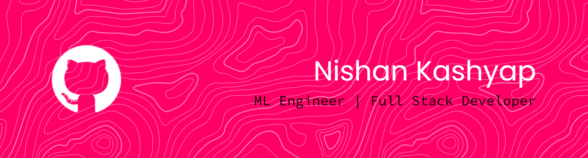






 



 
 

---





 

 





 

---







 





 




 





 

---







  
  &nbsp;
  









 

---











 



⭐ If you find my work useful, consider starring a repo — it genuinely helps!


